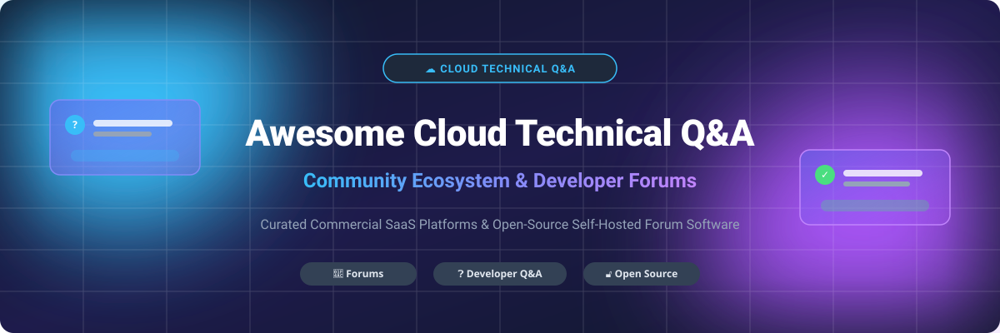

# Awesome-Cloud-Technical-Q-A-Community 💬 🌐

  

  
  
  
  
  
  

---

## 🌟 Top Cloud Technical Q&A Community Ecosystem

**Curated Directory of Commercial SaaS Platforms & Open-Source Q&A Forum Software**  
*Focused on Developer Q&A, Knowledge Sharing, Community Forums, Reputation Systems, Moderation Tools & Self-Hosted Discussion Platforms.*

**Last updated:** October 2026 📅

---

### 📌 Overview & SEO Summary

Welcome to the ultimate curated directory of **technical Q&A communities**, **open-source forum platforms**, and **developer discussion tools**. Whether you are looking for enterprise-grade commercial solutions (such as *Stack Overflow for Teams*, *Discourse Cloud*, *AWS re:Post*, and *Khoros*), or self-hostable open-source alternatives (like *Apache Answer*, *Discourse*, *Flarum*, and *Question2Answer*), this list covers category leaders, reputation engines, and privacy-respecting community platforms.

**Key Market Insights:**
- **Stack Overflow for Teams** remains the gold standard for private internal developer Q&A with native IDE & chat integrations.
- **Discourse** leads open-source community platforms powering thousands of developer communities worldwide.
- **AWS re:Post** provides vendor-curated, free technical Q&A for the AWS cloud ecosystem.

---

## 📑 Table of Contents

- [🏢 SaaS & Commercial Platforms](#-saas--commercial-platforms)
- [🔓 Open-Source GitHub Projects](#-open-source-github-projects)
- [🛠️ How to Contribute](#%EF%B8%8F-how-to-contribute)
- [📊 Star History](#-star-history)
- [🤝 Support & Sponsorship](#-support--sponsorship)
- [⚠️ Disclaimer](#%EF%B8%8F-disclaimer)

---

## 🏢 SaaS / Commercial Platforms

📊 **Sector Market Analysis (2026):** The global Enterprise Community & Developer Q&A Software sector is estimated at **~$3.8 Billion**, expanding at a **14.2% CAGR**. The sector is **moderately fragmented**, led by cloud hyperscalers (Microsoft/GitHub, AWS) alongside enterprise community stalwarts (Khoros, Stack Overflow) and specialized modern SaaS engines (Discourse, Circle.so, Bettermode).

*Sorted by Company Size / Valuation (Descending)* 📈

| 🏢 SaaS Platform | 🏢 Company / Owner | 📈 Company Size (Valuation / Rev) | 💵 Starting Pricing | 🎁 Free Tier Limit / Trial | 📌 Description |
| :--- | :--- | :--- | :--- | :--- | :--- |
| **[GitHub Discussions](https://github.com/features/discussions)** 🐙 | Microsoft / GitHub | \$3.90 Trillion Market Cap (\$245B Rev) | **\$0 (Included with GitHub)** | **Free forever for public & private repositories** | **GitHub-native discussions** — Q&A threads, announcements & category moderation built directly into developer workflows. |
| **[AWS re:Post](https://repost.aws/)** ☁️ | Amazon / AWS | \$2.00 Trillion Market Cap (\$575B Rev) | **\$0 (Free service)** | **Free forever for all AWS users** | **AWS-native technical Q&A community** — Expert-verified answers, reputation badges, and AWS re:Post Private for enterprises. |
| **[Reddit Pro](https://www.reddit.com/pro/)** 👽 | Reddit | \$10.0 Billion Market Cap (\$800M Rev) | **\$0 (Free for eligible users)** | **Free forever for eligible verified business profiles** | **Community portal for enterprise brands** — Advanced analytics and management tools for developer & brand subreddits. |
| **[Khoros Communities](https://khoros.com/)** 🏢 | Khoros (Vista Equity) | \$2.0 Billion Valuation (\$250M Rev) | **\$1,500/month (Enterprise Plan)** | **30-day sandbox trial / interactive demo** | **Enterprise community platform** — Scalable customer communities with gamification, moderation, and deep analytics. |
| **[Stack Overflow for Teams](https://stackoverflow.co/teams/)** 📚 | Stack Overflow (Prosus) | \$1.8 Billion Valuation (\$100M Rev) | **\$6/user/month (Basic Edition)** | **Free forever up to 50 users (Basic plan)** | **Private developer Q&A platform** — Secure knowledge management with AI semantic search, Slack, and Jira integrations. |
| **[Circle.so](https://circle.so/)** ⭕ | Circle | \$200 Million Valuation (\$30M ARR) | **\$89/month (Professional Plan)** | **14-day free trial (all features unlocked)** | **Modern all-in-one community platform** — Discussions, member directories, live events, and custom content tiers. |
| **[Vanilla Forums](https://vanillaforums.com/)** 🍦 | Higher Logic | \$100 Million Rev (Private) | **\$1,250/month (Business Plan)** | **14-day guided sandbox trial** | **Cloud community platform** — Enterprise-grade Q&A, knowledge bases, ideation, and CRM integrations. |
| **[Discourse Cloud](https://www.discourse.org/)** 💬 | Discourse (CDCK) | \$10 Million ARR (Private) | **\$100/month (Standard Plan)** | **14-day free trial (Cloud); Free forever self-hosted OS** | **Modern forum software** — Real-time chat, topic threading, trust levels, and an extensive plugin ecosystem. |
| **[Bettermode](https://bettermode.com/)** 🎨 | Bettermode | \$5 Million ARR (Private) | **\$49/month (Pro Plan)** | **Free forever (up to 5 spaces & 100 members)** | **No-code community software** — Modular Q&A, discussion boards, event hubs, and seamless widget embeds. |
| **[AnswerHub](https://www.answerhub.com/)** ❓ | Devada | \$5 Million Rev (Private) | **\$499/month (Starter Edition)** | **14-day trial & live interactive demo** | **Enterprise Q&A platform** — Internal developer portals and customer support Q&A with reputation engines. |

---

## 🔓 Open-Source GitHub Projects

*Sorted by GitHub Stars_Count (Descending)* 🌟

- **[Discourse](https://github.com/discourse/discourse)**   
  **The leading open-source community forum platform**, GPL-2.0 licensed. **42,000+ GitHub_Stars**. Features real-time notifications, trust levels, mailing list mode, and Docker-based deployment. Used by Docker, GitHub, and thousands of tech communities. 💬

- **[Forem](https://github.com/forem/forem)**   
  **Open-source software powering DEV.to**, AGPL-3.0 licensed. **22,500+ GitHub_Stars**. Built with Ruby on Rails, supporting posts, discussions, podcasts, and community feeds. 📝

- **[Flarum](https://github.com/flarum/flarum)**   
  **Delightfully simple open-source forum software**, MIT licensed. **16,200+ GitHub_Stars**. Lightweight PHP & Mithril.js architecture with modern UI and extension system. ✨

- **[NodeBB](https://github.com/NodeBB/NodeBB)**   
  **Node.js community forum software**, GPL-3.0 licensed. **14,500+ GitHub_Stars**. Real-time streaming, webhooks, and modern responsive design. 🟢

- **[Lemmy](https://github.com/LemmyNet/lemmy)**   
  **Federated forum & link aggregator**, AGPL-3.0 licensed. **12,800+ GitHub_Stars**. Written in Rust using ActivityPub protocol for decentralized discussion. 🐭

- **[Answer](https://github.com/apache/incubator-answer)**   
  **Apache Incubator Q&A platform**, Apache-2.0 licensed. **12,200+ GitHub_Stars**. Modern Go & React architecture designed specifically for developer teams and communities. ❓

- **[Vanilla Forums OS](https://github.com/vanilla/vanilla)**   
  **Flexible open-source multi-forum platform**, GPL-2.0 licensed. **5,600+ GitHub_Stars**. Proven PHP forum framework with plugin extensibility. 🍦

- **[Question2Answer](https://github.com/q2a/question2answer)**   
  **Classic open-source Stack Overflow clone**, GPL-2.0 licensed. **2,500+ GitHub_Stars**. PHP/MySQL Q&A framework with voting, tags, and badges. 🏛️

- **[Talkyard](https://github.com/debiki/talkyard)**   
  **Combined forum, chat, and Q&A engine**, AGPL-3.0 licensed. **2,100+ GitHub_Stars**. Embedded discussions for documentation and sites. 💭

- **[Scoold](https://github.com/Erudika/scoold)**   
  **Lightweight Java Q&A platform**, Apache-2.0 licensed. **1,600+ GitHub_Stars**. Stack Overflow alternative built on top of Para backend. ☕

- **[Codidact](https://github.com/codidact/core)**   
  **Community-built Q&A platform**, AGPL-3.0 licensed. **850+ GitHub_Stars**. Open-source Q&A community focused on transparent governance. 🌐

- **[Askbot](https://github.com/ASKBOT/askbot-devel)**   
  **Django-based Q&A forum software**, GPL-3.0 licensed. **750+ GitHub_Stars**. Python Q&A system with customizable templates. 🐍

---

## 🛠️ How to Contribute

Contributions are welcome! Follow these steps to submit new Q&A community platforms or open-source forum software:

1. 🍴 **Fork** the repository.
2. 📝 **Add/edit** entries maintaining markdown structure and formatting.
3. 🔗 Include official link, Stars_Badge, license, starting pricing, and clear description.
4. 🚀 Submit a **Pull Request** with a concise summary.

---

## 📊 Star History

---

## 🤝 Support & Sponsorship

If you find this technical Q&A community resource valuable, please consider supporting the project:

- ⭐ **Star** this repository to help others discover it!
- 🔀 **Fork** and share with fellow developers, DevOps engineers, and community managers.
- ☕ **Sponsor / Buy Me a Coffee:** Support ongoing curation via the [GitHub Sponsor Dashboard](https://github.com/sponsors/ishandutta2007).

---

## ⚠️ Disclaimer

- This list is **community-curated** for educational & comparison purposes. ℹ️
- Pricing, valuations, and Stars_Counts are updated periodically.
- For self-hosted open-source software, factor in infrastructure, security, and maintenance costs.

---

  <b>Made with ❤️ for developers, community managers, and open-source Q&A advocates.</b>

